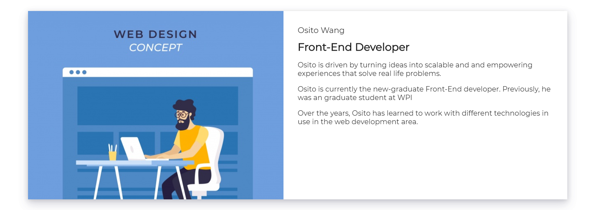
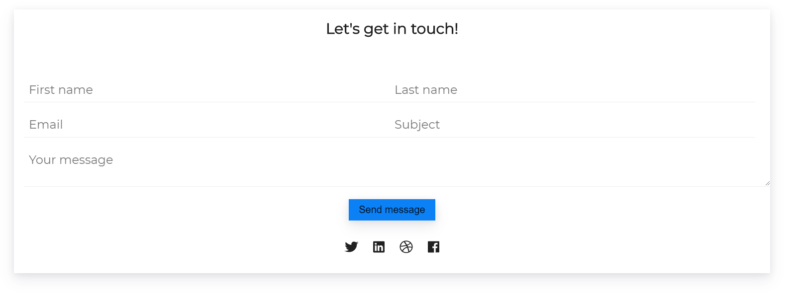

# Daily Web UI Demos

> The best way to learn how to code is writing code.  

Complete an UI exercise every day. You will be a totally different developer in a month.This repo includes the UI demos I have done for trial,  
replication and fun.

## Responsive Flipping Card with React

Flipping Card is a common way to provide a better and room-saving User Interfaces. This 
Flipping Card is fully responsive done in React.js.

