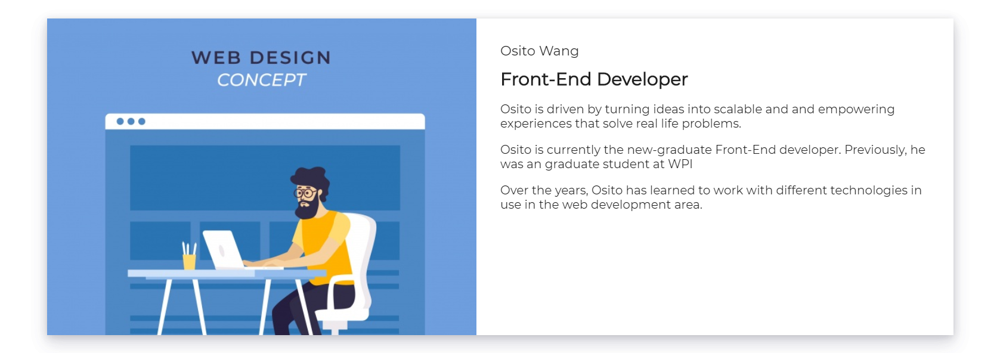
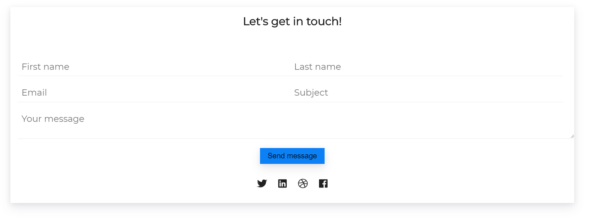
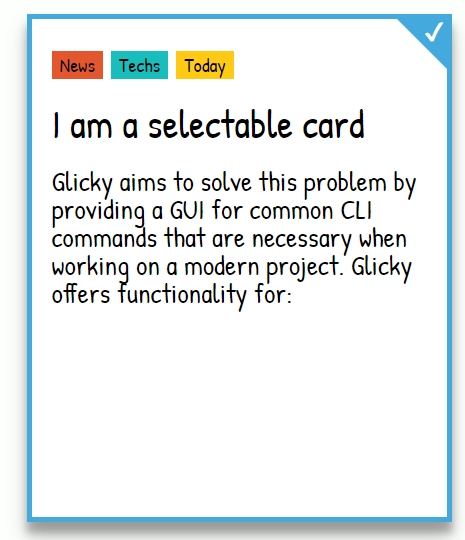
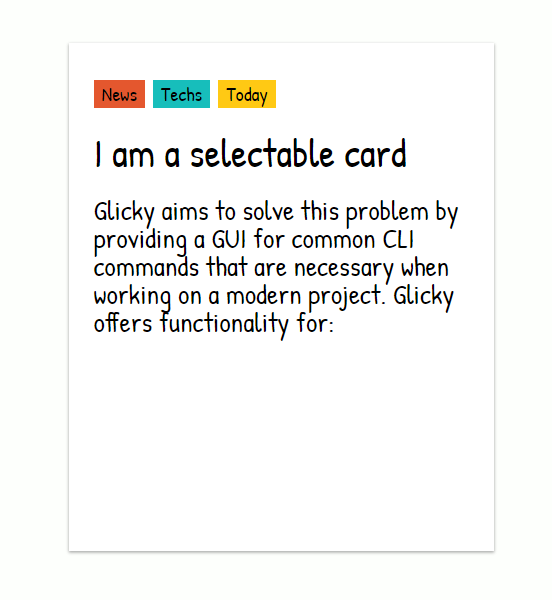

# Daily Web UI Demos

> The best way to learn how to code is writing code.

Complete an UI exercise every day. You will be a totally different developer in a month.This repo includes the UI demos I have done for trial,  
replication and fun.

## Responsive Flipping Card with React

Flipping Card is a common way to provide a better and room-saving User Interfaces. This
Flipping Card is fully responsive done in React.js.

## Reusable Tagged Selectable Card with React

Tagged Selectable Card is a reusable card with selected styles and tags. It is very suitable for News Website, Information Presentation with categories

## Neon-styled Toggle Button

A Neon-styled toggle button hacked with checkbox and pseudo elements. You could find a live demo on
[Neon Button](https://codesandbox.io/s/j2k317j1q3)

- [ ] Consider change it into a more react way of animation

## Carousel with React Hooks

A simple carousel with react hooks `useEffect`. Hooks make reusable far easier. [React Hooks Carousel](https://codesandbox.io/s/moz7nj31mp).

## Single File drop with React Hooks

A simple single file drop component with React hooks with detailed explanation. [React Hooks FileDrop](https://codesandbox.io/s/614827mmkz).
